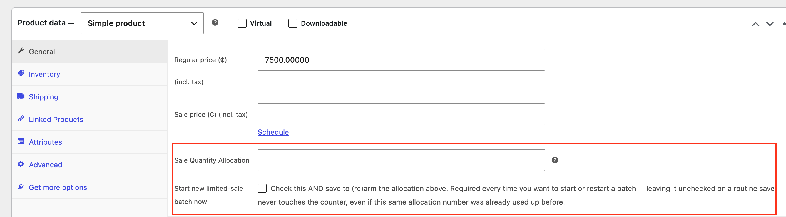

# Limited Sale Quantity for WooCommerce

Cap how many units of a product sell at the WooCommerce sale price — and have it revert to regular price automatically once that many units are gone, even if more physical stock remains.

## The problem this solves

WooCommerce lets you set a sale price and (optionally) a schedule for when it starts/ends. But there's no built-in way to say: *"I have 20 of this in stock, but I only want to discount the first 3 sold — after that, back to full price."*

Without a quantity cap, a sale price with no end date just... keeps selling at that price forever, or until someone remembers to remove it by hand.

This plugin adds that missing piece: a **Sale Quantity Allocation** field. Set it to `3`, and the moment 3 units have sold — from a real WooCommerce order, a stock reduction from an external inventory sync, a POS system, or a manual edit — the sale price is cleared automatically. The product reverts to its regular price, not just visually, but for real (the underlying `_sale_price` field is cleared).

## Features

- **Quantity-limited sales** — set a max number of units to sell at the discounted price, independent of total stock.
- **Source-agnostic tracking** — works whether stock drops from a checkout, a manual wp-admin edit, or any external system updating stock via the REST API (built and tested against an inFlow Inventory sync, but not inFlow-specific in any way).
- **"Only N left at this price!" badge** — shown automatically on the product page and shop loop while the allocation is still active.
- **Manual re-arming only** — once a batch sells out, the sale stays off until you explicitly restart it (see below). Restocking alone does not silently reactivate a sale.
- **Works on simple and variable products** — allocation + arm checkbox available per-variation as well as on simple products.

## Installation

### Option A: Download the ready-made zip (recommended)

1. Go to the [latest release](https://github.com/Drickles1/wc-limited-sale-quantity/releases/latest) and download `limited-sale-quantity-for-woocommerce-X.Y.Z.zip`.
2. In wp-admin, go to **Plugins → Add New → Upload Plugin**, choose the zip, and click **Install Now**.
3. Activate **Limited Sale Quantity for WooCommerce** from the Plugins screen.

### Option B: Clone the repo

1. Clone this repo into `wp-content/plugins/limited-sale-quantity-for-woocommerce/`.
2. Activate **Limited Sale Quantity for WooCommerce** from the Plugins screen.

### Either way

Edit any product, and you'll see two new fields in the **Pricing** section (General tab for simple products, per-variation for variable products):
- **Sale Quantity Allocation** — the number of units to sell at the sale price.
- **Start new limited-sale batch now** — a checkbox you must tick (and save) to actually arm/re-arm the allocation.

## How to run a limited sale

1. Set a **Sale price** (and optionally a sale schedule) as you normally would in WooCommerce.
2. Enter a number in **Sale Quantity Allocation** (e.g. `3`).
3. Tick **Start new limited-sale batch now**.
4. Save/update the product.

From this point, the plugin watches the product's stock quantity. Every unit sold (by any means) counts against the allocation. When the allocation reaches 0, the sale price and any sale schedule dates are cleared automatically.

### Restarting a batch later

If stock comes back in and you want to run another limited batch, you must:
1. Re-enter (or update) the allocation number.
2. Tick **Start new limited-sale batch now** again.
3. Save.

This is deliberate. The allocation field is pre-filled with its last value, so it would resubmit on *any* product save — including ones where you're just editing the description or an unrelated field. Requiring the checkbox is what makes "manual re-arm only" actually manual instead of accidentally reactivating a sold-out sale on the next unrelated edit.

## How it works internally

- The plugin stores a small amount of post meta per product: the configured allocation, a "remaining" counter, and the stock quantity it last observed.
- It hooks `woocommerce_product_set_stock` / `woocommerce_variation_set_stock` — WooCommerce's own action that fires whenever a stock-managed product's quantity changes, regardless of the cause. On every fire, it computes the delta against the last-observed stock and decrements the remaining counter by that amount.
- When the counter hits 0 and the product is currently on sale, it calls `set_sale_price('')` and clears the sale schedule dates, then saves — a real, permanent removal of the discount, not a display-only trick.
- A reentrancy guard prevents the handler's own `save()` call from re-triggering itself (WooCommerce fires the stock-set action from inside `save()` on any stock-managed product).

## Known limitations

- The "Only N left" badge is proven for simple products. On variable products, WooCommerce swaps variation data via AJAX/JS without re-running this PHP hook per variation, so the badge reflects whatever variation WooCommerce's own template loop currently has in scope rather than updating live as a shopper picks a different variation. The admin-side allocation/arming logic fully supports variations regardless.
- No REST API exposure for the allocation fields yet (they're wp-admin/UI only). If you need to set allocations programmatically, they're plain post meta (`_lsqw_sale_qty_allocation`, etc.) and can be read/written directly.

## License

GPL-2.0-or-later — see [LICENSE](LICENSE). Same license as WordPress core and the vast majority of the WordPress plugin ecosystem.

## Contributing

Issues and pull requests welcome.
